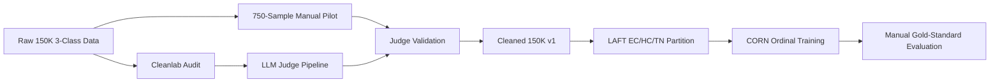

# Neutral Class Fix Plan

## Purpose

This document replaces the earlier attention-based classifier plan with the updated direction from the Claude, Gemini, and Qwen deep-research reports. The consensus across those reports is that the neutral-class problem is primarily a **data quality and ordinal-loss problem**, not a model-capacity or attention-architecture problem.

The implementation target is a SOTA-inspired, Colab-compatible stack:

1. **Confident Learning audit** with cleanlab to identify likely label errors.
2. **LLM-as-judge validation** using a free or low-cost 70B-class open model with rubric-guided reasoning.
3. **LAFT-style partitioning** to separate clean, hard-clean, and true-noisy samples.
4. **CORN ordinal classification** so the model respects the sentiment order: negative < neutral < positive.
5. **Differential loss training** where noisy samples use soft labels instead of corrupting the model with hard star-rating labels.

The goal is not to force every 3-star review to remain neutral. The goal is to build a defensible cleaned/soft-labeled 3-class setup and evaluate it against a human-validated test set.

## 1. Problem Recap

The current 3-class setup maps Amazon star ratings into:

| Star Rating | Sentiment Label |
|---|---|
| 1-2 stars | Negative |
| 3 stars | Neutral |
| 4-5 stars | Positive |

Current evidence:

| Experiment | Training Samples | Overall Accuracy | Neutral Recall |
|---|---:|---:|---:|
| 3-class baseline | 150,000 | 74.12% | 38.01% |
| 3-class sequential | 300,000 | 74.66% | 39.69% |
| Binary baseline, excluding 3-star reviews | 150,000 | 96.28-96.48% | N/A |

Sequential training doubled the data but barely improved neutral recall. Binary classification performs extremely well once 3-star reviews are removed. This supports the conclusion that the main bottleneck is **rating-text mismatch in 3-star labels**, not sequence length, insufficient data, or weak model capacity.

## 2. Updated Working Hypothesis

The working hypothesis is:

> The neutral-class bottleneck can be improved by correcting and softening noisy supervision, then training with an ordinal-aware objective that respects the negative-neutral-positive continuum.

Expected outcome:

| Model Variant | Expected Result |
|---|---:|
| Current raw 3-class model | ~74-75% |
| Raw labels + label smoothing | ~76-78% |
| Cleaned hard labels + label smoothing | ~84-87% |
| LAFT-style soft labels + CORN ordinal head | ~87-90% |

These targets should be judged on a manually validated evaluation set, not only on noisy star-derived labels.

## 3. Method Stack



### Core References

| Method | Role |
|---|---|
| Confident Learning / cleanlab | Identify likely label errors using out-of-fold predicted probabilities |
| LAFT | Separate easy-clean, hard-clean, and true-noisy samples using external guidance |
| CORN | Enforce rank-consistent ordinal predictions |
| SORD / label smoothing | Represent ambiguity as soft labels rather than brittle hard labels |
| LLM-as-Judge | Scalable text-based re-annotation of ambiguous 3-star reviews |

## 4. Phase 1: Data Foundation

### 4.1 Cleanlab Audit

Run a full audit on the 150K 3-class dataset:

1. Train or load the existing LLaMA 3.1-8B 3-class model.
2. Generate out-of-fold predicted probabilities.
3. Run `cleanlab.filter.find_label_issues`.
4. Save a ranked list of likely label errors.

Expected artifact:

```text
results/cleanlab_audit.json
```

### 4.2 Manual Labeling Pilot

Create a 750-sample gold-standard pilot:

| Source | Count | Purpose |
|---|---:|---|
| Random 3-star reviews | 500 | Estimate natural 3-star noise rate |
| Top cleanlab-flagged samples | 250 | Validate model-identified label errors |

Manual labels should be based on review text, not the star rating.

| Manual Label | Guideline |
|---|---|
| Negative | Dominant dissatisfaction, failure, misleading claims, poor quality, or regret |
| Neutral | Genuinely mixed, balanced, factual, weakly opinionated, or ambivalent |
| Positive | Dominant satisfaction, recommendation, usefulness, good quality, or approval |

Expected artifact:

```text
results/manual_labels_750.csv
```

### 4.3 Noise Rate Analysis

Compute:

- True neutral share among 3-star reviews.
- 3-star reviews that are textually negative.
- 3-star reviews that are textually positive.
- Agreement between manual labels and cleanlab flags.

Expected artifacts:

```text
results/true_noise_rate.json
docs/reports/NOISE_RATE_FINDINGS.md
```

## 5. Phase 2: LLM-Judge Pipeline

### 5.1 Judge Model

Use free or existing-access inference first:

| Priority | Model / Service | Rationale |
|---|---|---|
| Primary | Llama 3.1 70B Instruct via free credits / free tier | Strong open judge, no direct cost if credits are available |
| Fallback | Qwen 2.5 72B Instruct via Hugging Face or other free endpoint | Strong reasoning model and aligns with Qwen report |
| Last resort | Local Mixtral 8x7B on Colab A100 | Slower, but avoids paid API calls |

Use low temperature (`0.2`) and strict JSON output.

### 5.2 Prompting Strategy

Use rubric-guided, explain-then-annotate prompting:

```text
System: You are a sentiment annotator. Use only the review text.

Rubric:
- negative: dissatisfaction dominates.
- neutral: sentiment is genuinely mixed, balanced, factual, weak, or ambivalent.
- positive: satisfaction dominates.

Step 1: Quote positive evidence.
Step 2: Quote negative evidence.
Step 3: Weigh the balance.

Return JSON:
{
  "label": "negative|neutral|positive",
  "confidence": 0.0,
  "probabilities": {"negative": 0.0, "neutral": 0.0, "positive": 0.0},
  "reasoning": "short explanation"
}
```

### 5.3 Validation Gate

Validate the judge against `results/manual_labels_750.csv`.

| Gate | Required Condition |
|---|---|
| Cohen's kappa | >= 0.70 |
| Per-class agreement | No catastrophic collapse on neutral |
| Confidence behavior | Low confidence on genuinely ambiguous cases |

If the gate fails, revise the prompt or use a two-judge ensemble.

### 5.4 Full 3-Star Pass

Run the validated judge over all 3-star reviews in the 150K set.

Expected artifact:

```text
results/llm_judge_50k.parquet
```

Then combine cleanlab and judge outputs into:

```text
data/cleaned_150k_v1.parquet
```

This dataset should contain:

- Original star-derived label.
- Cleaned hard label where confidence is high.
- Soft-label probability distribution where ambiguity remains.
- Flags for cleanlab issue status and judge confidence.

## 6. Phase 3: LAFT + CORN Training

### 6.1 LAFT Partitions

Each training sample is assigned to one of three partitions:

| Partition | Criteria | Training Signal |
|---|---|---|
| Easy Clean (EC) | Original label agrees with judge | Standard cross-entropy on original label |
| Hard Clean (HC) | Disagreement exists but judge confidence is low | Down-weighted cross-entropy on original label |
| True Noisy (TN) | Judge confidently disagrees with original label | Soft-label cross-entropy using judge probabilities |

### 6.2 CORN Ordinal Head

CORN treats 3-class sentiment as ordered:

```text
negative < neutral < positive
```

This prevents the model from treating all class mistakes as equally distant. Confusing neutral with negative is less severe than confusing negative with positive.

### 6.3 Training Variants

| Variant | Data | Loss | Head | Purpose |
|---|---|---|---|---|
| A | Raw 150K | Standard CE | Standard | Reproduce old baseline |
| B | Cleaned hard labels | CE + label smoothing | Standard | Isolate cleaning gain |
| C | Cleaned hard + soft labels | LAFT differential loss | CORN | Full SOTA stack |

### 6.4 Evaluation

Primary evaluation:

```text
results/manual_labels_750.csv
```

Secondary evaluation:

- Original noisy 5K eval set.
- 5K random held-out samples not used in training.

Metrics:

- Accuracy
- Macro precision/recall/F1
- Neutral recall
- Confusion matrix
- Ordinal MAE
- Negative-neutral confusion rate

## 7. Decision Gates

| Gate | When | Required Condition | If Failed |
|---|---|---|---|
| Gate 1 | After manual pilot | Noise rate is substantial enough to justify cleaning | Use label smoothing only and report smaller gain |
| Gate 2 | After judge validation | Cohen's kappa >= 0.70 | Iterate prompt or add second judge |
| Gate 3 | After Variant B | Cleaning improves baseline by meaningful margin | Re-check labels and cleanlab thresholds |
| Gate 4 | After Variant C | Full stack beats Variant B by >=3 points or improves neutral recall strongly | Use Variant B as final and document LAFT/CORN negative result |

## 8. Success Criteria

Paper-ready target:

| Metric | Target |
|---|---:|
| Clean eval accuracy | 85-90% |
| Clean eval neutral recall | >=70% |
| Drop in negative/positive recall | <=5 percentage points |
| Judge/manual agreement | Cohen's kappa >=0.70 |
| Cross-category replication | At least 1 additional category after Cell Phones |

## 9. Connection to Poisoning Research

This plan should not treat natural label noise only as a nuisance. The neutral boundary is a research asset for poisoning:

1. **Noisy baseline:** raw 3-class star labels.
2. **Cleaned baseline:** LAFT/CORN corrected labels.
3. **Poisoned baseline:** cleaned data plus controlled label flips or triggers.

This enables a stronger research question:

> How does natural label noise at the negative-neutral boundary affect poisoning attack success and detection difficulty?

This connects the neutral-class fix directly to Souly-style poisoning work and influence-based unlearning.

## 10. Immediate Implementation Order

1. Update roadmap and summary documentation to reflect the LAFT + CORN stack.
2. Implement cleanlab audit script.
3. Implement manual labeling tool.
4. Implement noise-rate analysis.
5. Implement LLM-judge client and prompt templates.
6. Validate judge against the manual pilot.
7. Build cleaned dataset v1.
8. Implement CORN head and LAFT loss.
9. Train and compare ablation variants.
10. Document results and decide whether to proceed to poisoning experiments.
